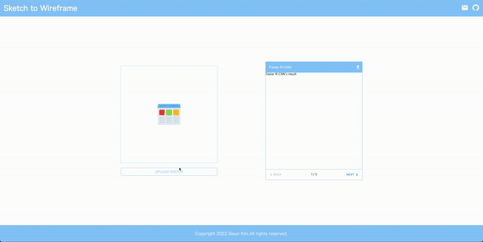

# **Sketch-to-Wireframe ✍️📱**

**Sketch-to-Wireframe**은 누구나 쉽고 빠르게 UI 스케치를 Wireframe으로 변환하는 것을 돕기 위해 제안한 프로젝트입니다. 사용자가 입력한 UI 스케치 내 UI 컴포넌트를 검출하고, 위치와 컴포넌트 종류 등의 검출 결과를 Material UI 컴포넌트와 매핑하여 하나의 Wireframe을 생성함으로써 사용자에게 보다 쉬운 Wirefrmae 변환 방법을 제공합니다. 

**데모 영상**

**문제점 및 한계**

데모 영상과 같이 하나의 UI 컴포넌트로 구성된 UI 스케치의 경우 물체 검출 성능이 괜찮은 반면, 여러 개의 UI 컴포넌트로 구성된 UI 스케치는 물체 검출 성능이 나쁜 편입니다. Wireframe은 여러 개의 UI 컴포넌트로 구성되므로, 현재 성능으로서는 정상적인 작동이 불가하여 추가 학습 또는 데이터셋 추가 등의 성능 개선의 노력이 필요합니다. 

**README.md**

[`back-end README.md 바로가기`](https://github.com/sieukim/sketch-to-wireframe/blob/main/back-end/README.md)

[`front-end README.md 바로가기`](https://github.com/sieukim/sketch-to-wireframe/blob/main/front-end/README.md)

[`model README.md 바로가기`](https://github.com/sieukim/sketch-to-wireframe/blob/main/model/README.md)