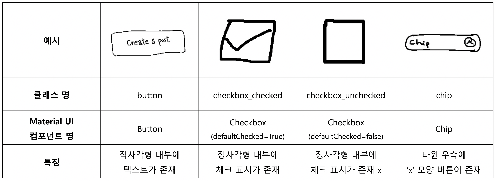
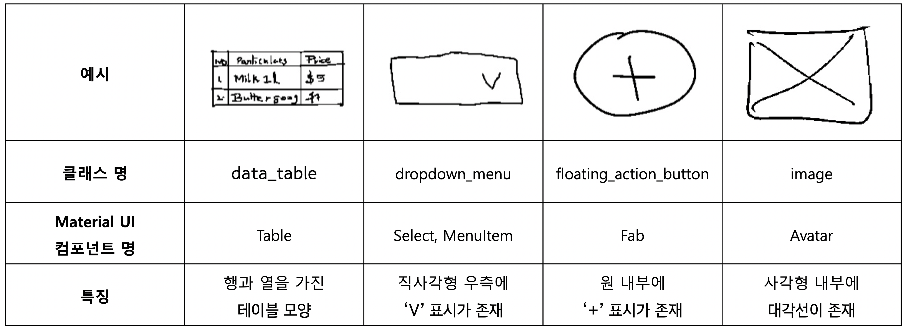
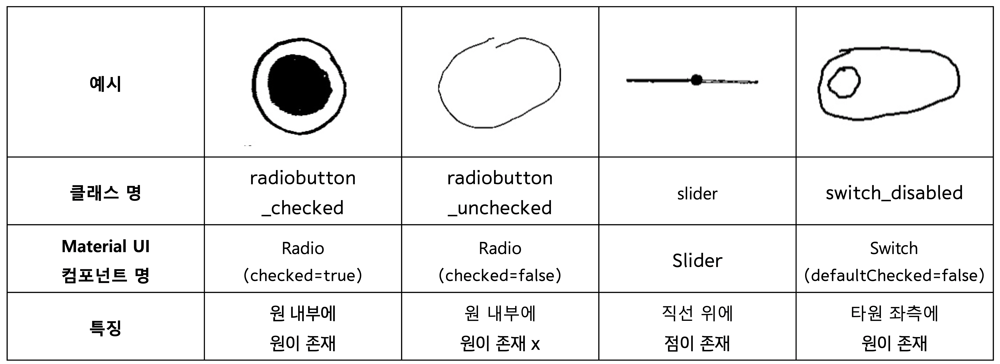
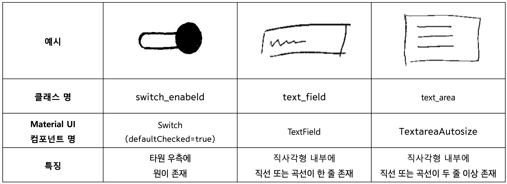
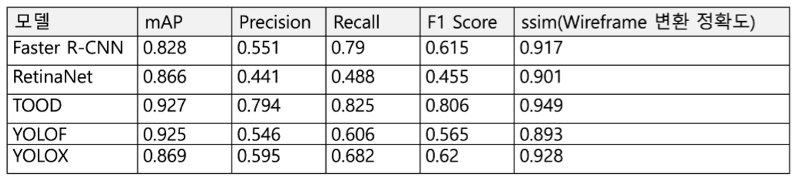

# **Model**

**개발 환경**
- Google Colab Pro+
- MMDetection 

**사용 데이터**
- [Kaggle UI Sketch Dataset](https://www.kaggle.com/datasets/vinothpandian/uisketch) 데이터를 활용 
- 총 21가지의 UI 컴포넌트 클래스 중 15가지의 UI 컴포넌트 클래스를 활용
- 각 클래스 당 100개의 이미지 데이터를 뽑아 총 1500개의 이미지 데이터를 활용
- 블러와 노이즈 효과를 활용하여 총 3301개의 데이터로 증강 
- Roboflow 내 어노테이션 툴을 활용하여 어노테이션 수행 및 COCO Dataset 생성

**UI 컴포넌트 종류**

**사용 모델**
- Faster R-CNN
- RetinaNet
- TOOD
- YOLOF
- YOLOX 

**성능 평가**

